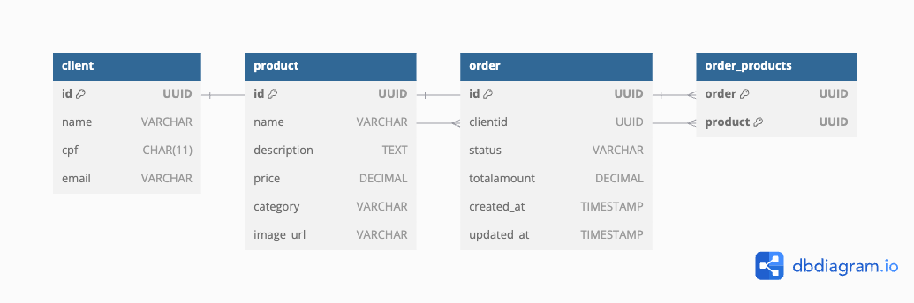

<h1 align="center">🍔 fast-food-system </h1>


## 📑 Descrição

Este projeto é um sistema de gerenciamento de pedidos para um fast-food, desenvolvido com NestJS e integrado ao Mercado Pago para geração de QR Codes e recebimento de notificações de pagamento. A aplicação é preparada para rodar em um cluster Kubernetes, utilizando Minikube como ambiente de desenvolvimento local.


## 🏛️ Arquitetura


### Desenho da Arquitetura
A arquitetura do sistema foi desenhada para garantir escalabilidade e alta disponibilidade, utilizando os componentes do Kubernetes para gerenciar a aplicação. Abaixo estão os principais componentes da arquitetura:

- Pods: Rodam a aplicação e são gerenciados pelo Kubernetes.
- Deployment: Gerencia as réplicas da aplicação, garantindo que um número específico de Pods esteja sempre disponível.
- Service: Expõe os Pods para que possam ser acessados internamente no cluster ou externamente.
- ConfigMap e Secrets: Armazenam configurações e credenciais sensíveis, como tokens do Mercado Pago.
- Ingress: Gerencia o acesso externo à aplicação, roteando o tráfego HTTP para o Service.
- HorizontalPodAutoscaler (HPA): Escala automaticamente o número de Pods com base no uso de CPU.

### Requisitos do Negócio
- **Gerenciamento de Pedidos**: A API permite criar pedidos, listar pedidos, gerenciar clientes e produtos e consultar o status de pagamento.
- **Integração com Mercado Pago**: A aplicação gera QR Codes para pagamentos e recebe notificações de mudanças de status de pagamento (por exemplo, "aprovado" ou "pendente").
- **Webhook para Notificações**: Um endpoint é configurado para receber notificações do Mercado Pago quando o status de pagamento é alterado.

### Requisitos de Infraestrutura
- **Minikube**: Utilizado como ambiente local de desenvolvimento para emular um cluster Kubernetes.
- **Kubernetes**: Orquestração de contêineres, gerenciando a disponibilidade e escalabilidade da aplicação.
- **Docker**: Criação de imagens da aplicação para serem executadas nos contêineres.
- **ConfigMap** e **Secrets**: Armazenam variáveis de ambiente e credenciais para evitar exposição de dados sensíveis no código.
- **HorizontalPodAutoscaler (HPA)**: Configurado para escalar de 2 a 10 réplicas conforme a utilização de CPU, mantendo o uso médio em 50%.

Lógica do Auto-scaling
O HPA monitora o uso de CPU dos Pods e ajusta o número de réplicas entre 2 e 10 conforme a demanda, garantindo que a aplicação mantenha a performance adequada mesmo em picos de tráfego.


## 🎲 Estrutura do Banco de Dados


### **Tabela: `client`**
- **Descrição:** Armazena informações dos clientes.
- **Colunas:**
  - `id` (UUID): Identificador único do cliente (chave primária).
  - `name` (VARCHAR): Nome completo do cliente.
  - `cpf` (CHAR[11]): Cadastro de Pessoa Física (CPF), único e formatado sem caracteres especiais.
  - `email` (VARCHAR): Endereço de e-mail único.
- **Regras:**
  - O campo `cpf` é formatado automaticamente para remover caracteres não numéricos.

---

### **Tabela: `product`**
- **Descrição:** Contém informações sobre os produtos disponíveis.
- **Colunas:**
  - `id` (UUID): Identificador único do produto (chave primária).
  - `name` (VARCHAR): Nome do produto.
  - `description` (TEXT): Descrição detalhada do produto.
  - `price` (DECIMAL): Preço unitário do produto.
  - `category` (ENUM): Categoria do produto (`Lanches`, `Acompanhamento`, `Bebida` e `Sobremesa`.).
  - `image_url` (VARCHAR, opcional): URL da imagem do produto.

---

### **Tabela: `order`**
- **Descrição:** Representa os pedidos realizados pelos clientes.
- **Colunas:**
  - `id` (UUID): Identificador único do pedido (chave primária).
  - `clientid` (UUID): Referência ao cliente que fez o pedido (chave estrangeira).
  - `status` (ENUM): Status do pedido, com os seguintes valores:
    - `Recebido`
    - `Em Preparação`
    - `Pronto`
    - `Finalizado`
  - `totalamount` (DECIMAL): Valor total do pedido.
  - `created_at` e `updated_at` (TIMESTAMP): Controle de criação e atualização (definidos automaticamente pelo banco).
- **Relacionamentos:**
  - Um cliente pode ter vários pedidos (1:N).
  - Um pedido pode conter vários produtos (N:M).

---

### **Tabela: `order_products`**
- **Descrição:** Tabela auxiliar para o relacionamento N:M entre `order` e `product`.
- **Colunas:**
  - `order` (UUID): Referência ao pedido.
  - `product` (UUID): Referência ao produto.

---

### **Relacionamentos**
1. **`client` → `order`:**
  - Relacionamento 1:N (um cliente pode fazer vários pedidos).
2. **`order` → `product`:**
  - Relacionamento N:M através da tabela intermediária `order_products`.

---

#### Detalhes Técnicos
- **Banco Utilizado:** Amazon RDS (PostgreSQL).
- **Justificativa:**
  1. **Gerenciamento Simplificado:** Redução do overhead operacional.
  2. **Segurança:** Criptografia em trânsito e em repouso.
  3. **Escalabilidade:** Suporte para cargas crescentes.

---


## 🛜 Instalação

npm: https://docs.npmjs.com/downloading-and-installing-node-js-and-npm

```bash
$ git clone https://github.com/ca-ayumi/fast-food-system.git
$ cd fast-food-system
$ npm install
```

## Setup

Criar o arquivo .env com as seguintes envs: 
```
#DB connection
DB_HOST=kesavan.db.elephantsql.com
DB_PORT=5432
DB_USERNAME=xwtyntcm
DB_PASSWORD=OeZkbCk6az33Y1nTRbi0cFY3-Gne7_mV
DB_NAME=xwtyntcm

#Mercado Pago
MERCADOPAGO_USER_ID=2023202558
MERCADOPAGO_EXTERNAL_POS_ID=FIAP2POS001
MERCADOPAGO_BASE_URL=https://api.mercadopago.com
MERCADOPAGO_ACCESS_TOKEN=APP_USR-4485502391533418-100613-4d38eab5caf4361ee25d6b580571b5fb-2023202558
MERCADOPAGO_NOTIFICATION_URL=https://3ec5-2804-1b3-8200-39e0-f4ba-4b43-bd54-d490.ngrok-free.app/mercadopago-webhook/merchant-order
```
**Atenção**: A URL configurada no MERCADOPAGO_NOTIFICATION_URL precisa ser exatamente a mesma utilizada nas configurações de Webhooks do painel do Mercado Pago. Isso garante que as notificações de eventos (como criação, fechamento ou expiração de ordens comerciais) sejam corretamente enviadas e processadas pela aplicação. Certifique-se de que a URL esteja acessível externamente e corretamente registrada no painel do Mercado Pago, conforme mostrado na imagem a seguir:


## Rodando a aplicação localmente

```bash
# development
$ npm run start

# watch mode
$ npm run start:dev

```

## Rodando a aplicação com Docker

```bash
# docker
$ docker-compose up --build
```

## 🛫 Migração do DB

```bash
# build
$ npm run build

# create migration
$ npm run typeorm migration:generate -- -n CreateInitialTables
$ npm run typeorm migration:run
```

## 🗒️ Documentação

- [Collection Postman](https://github.com/ca-ayumi/fast-food-system/blob/main/FIAP.postman_collection.json)
- [Swagger](http://localhost:3000/api#/)
- [Link Youtube](https://youtu.be/Rv1ew_ESg-w)

## 📌 Tecnologias

- [NestJS](https://nestjs.com/) - Framework para NodeJS
- [Jest](https://jestjs.io/pt-BR/) - Framework de testes
- [ESLint](https://eslint.org/) - Análise e limpeza de código fonte
- [Prettier](https://prettier.io/) - Formatador de código fonte
- [Swagger](https://swagger.io/) - Framework para processo de documentação
- [TypeORM](https://typeorm.io/) - ORM para TypeScript
- [PostgreSQL](https://www.postgresql.org/) - Banco de dados relacional
- [Docker](https://docs.docker.com/) - Ferramenta para criar e gerenciar imagens de contêineres da aplicação.
- [Minikube](https://minikube.sigs.k8s.io/docs/start/?arch=%2Fmacos%2Farm64%2Fstable%2Fbinary+download) - Emulador de ambiente Kubernetes local.
- [Kubernetes](https://kubernetes.io/pt-br/) - Plataforma para orquestração de contêineres.
- [Mercado Pago](https://www.mercadopago.com.br/developers/pt) - Plataforma de pagamentos usada para processar pagamentos e gerar QR Codes.
